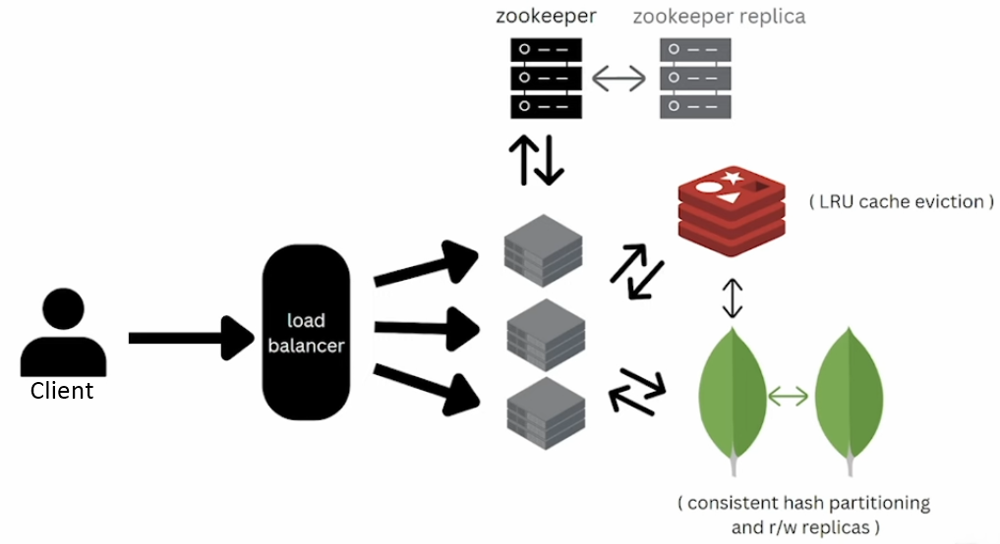

# 🔗 Scalable URL Shortener System Design

## 📌 Problem Statement
Design a URL shortening service that converts long URLs into short, unique links and efficiently redirects users when accessed.

---

## ✅ Functional Requirements
- Generate short URL from long URL
- Redirect short URL to original URL
- Support URL expiry
- User authentication (signup/login/logout)
- Delete shortened URLs

---

## ⚙️ Non-Functional Requirements
- Highly available system
- Low latency redirects
- Scalable to millions of users
- Short URLs should be non-predictable
- Fault tolerant

---

## 📊 Capacity Estimation

### Assumptions:
- 1 million URLs created per month
- Read to write ratio = 100:1
- URL expiry = 10 years
- Average URL size = 500 bytes

### Storage:
Total URLs = 1M × 12 × 10 = 120M  
Storage = 120M × 500 bytes = **~60 GB**

---

### Traffic:
- Reads per month = 100M
- Reads per second ≈ 50 QPS
- Reads per day ≈ 5M

---

### Cache Estimation:
- Cache 25% of daily reads = 1.25M entries
- Memory = 1.25M × 500 bytes ≈ **1 GB RAM**

---

## 🏗️ High-Level Architecture

### Components:
- **Load Balancer** → distributes traffic
- **Application Servers** → stateless services
- **Redis Cache** → fast read access (LRU eviction)
- **MongoDB** → persistent storage with partitioning
- **Zookeeper** → distributed ID generation

---

## 🔁 Request Flow

### Write Flow (Shorten URL)
1. Client sends request to Load Balancer
2. Request routed to an application server
3. Server requests unique ID from Zookeeper
4. ID converted to short URL using Base62 encoding
5. Mapping stored in MongoDB
6. Response returned to client

---

### Read Flow (Redirect)
1. Client hits short URL
2. Load balancer routes request
3. Server checks Redis cache
   - If found → return original URL
   - If not → fetch from MongoDB and update cache
4. Redirect user

---

## 🧮 URL Generation Strategy

- Character set: `[0-9, a-z, A-Z]` → 62 characters
- Base62 encoding used
- Required combinations:
  62⁵ > 120M → 5 character short URL sufficient

---

## ⚡ Caching Strategy

- Redis used for fast lookups
- LRU eviction policy
- Cache only hot URLs (~25%)

---

## 🗄️ Database Design

### MongoDB Collections:

#### URL Collection
- shortUrl
- originalUrl
- userId
- expiryDate
- createdAt

#### User Collection
- userId
- name
- email
- apiKey
- createdAt

---

## 🔀 Data Partitioning

- Consistent hashing used
- Horizontal scaling across multiple nodes
- Read replicas for high availability

---

## 🔑 ID Generation (Zookeeper)

- Distributed range allocation
- Each server gets a unique ID range:
  - Server1: 0–250000
  - Server2: 250001–500000
  - etc.
- Eliminates central bottleneck

---

## ⚖️ Trade-offs

| Decision | Reason |
|--------|--------|
| MongoDB | Easy scaling, flexible schema |
| Eventual consistency | Acceptable for this system |
| Redis cache | Improves read latency |
| Zookeeper | Ensures unique ID generation |

---

## 🚀 Scaling Strategies

- Add more stateless application servers
- Scale Redis horizontally
- Use MongoDB sharding
- Introduce CDN for global performance

---

## 🔒 Security Considerations

- Non-predictable URLs via Base62
- API key authentication
- Rate limiting (future improvement)

---

## 📌 Future Improvements

- Analytics (click tracking)
- Custom aliases
- Rate limiting
- Geo-based routing

---
